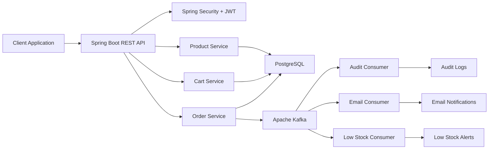
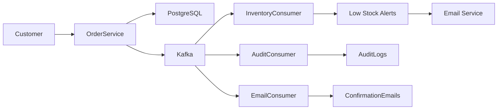
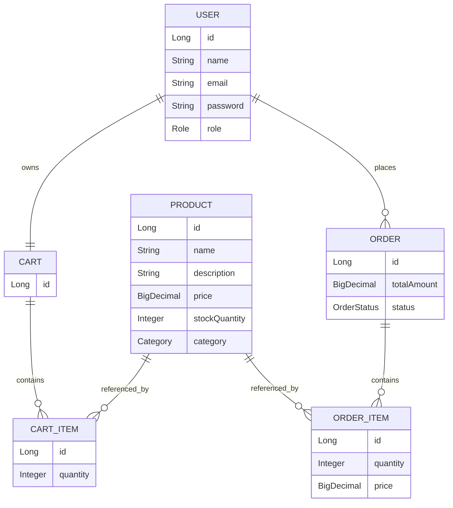

# Smart Commerce Backend

Smart Commerce Backend is a production-oriented e-commerce backend built using Spring Boot and modern backend engineering practices. The system provides secure authentication, product management, shopping cart operations, order processing, event-driven communication with Apache Kafka, email notifications, audit logging, and resilient message processing through Dead Letter Queues (DLQ).

The project demonstrates enterprise backend architecture with a focus on scalability, maintainability, observability, and asynchronous event processing.

---

## Highlights

- JWT Authentication & Authorization
- Role-Based Access Control (ADMIN / CUSTOMER)
- Product Catalog Management
- Shopping Cart Management
- Order Processing Workflow
- Apache Kafka Event-Driven Architecture
- Email Notifications
- Audit Logging
- Dead Letter Queue (DLQ) Handling
- PostgreSQL Persistence
- Dockerized Infrastructure
- Swagger/OpenAPI Documentation
- Global Exception Handling
- Pagination & Search Support

---

## Tech Stack

| Layer | Technology |
|---------|---------|
| Language | Java 21 |
| Framework | Spring Boot 3 |
| Security | Spring Security, JWT |
| Database | PostgreSQL |
| ORM | Spring Data JPA, Hibernate |
| Messaging | Apache Kafka |
| API Documentation | Swagger / OpenAPI |
| Build Tool | Maven |
| Containerization | Docker, Docker Compose |
| Mail Service | Spring Mail |

---

## Architecture Overview



---

## Kafka Event Architecture

### Topics

| Topic | Purpose |
|---------|---------|
| order-created | Order placement events |
| order-cancelled | Order cancellation events |
| low-stock | Inventory alert events |
| order-created-dlt | Dead Letter Queue |

### Event Flow



---

## Core Features

### Authentication & Security

- User Registration
- User Login
- JWT Token Generation
- JWT Validation
- Role-Based Access Control
- Protected Endpoints
- Spring Security Integration

### Product Management

ADMIN users can:

- Create Products
- Update Products
- Delete Products
- Manage Inventory

All users can:

- Browse Products
- Search Products
- Filter by Category
- View Product Details

### Shopping Cart

CUSTOMER users can:

- Add Products to Cart
- Update Quantities
- Remove Cart Items
- Clear Entire Cart
- View Cart Summary

### Order Management

CUSTOMER users can:

- Place Orders
- View Order History
- View Order Details
- Cancel Pending Orders

---

## Email Notification System

### Order Confirmation Emails

Automatically sent when an order is successfully placed.

### Low Stock Alerts

Automatically sent when inventory falls below the configured threshold.

---

## Audit Logging

The system currently records audit events for:

- Order Creation
- Order Cancellation

Audit records are written asynchronously through Kafka consumers.

---

## Dead Letter Queue (DLQ)

Failed Kafka messages are automatically:

1. Retried 3 times
2. Delayed by 2 seconds between retries
3. Redirected to a Dead Letter Topic if retries fail

```text
order-created
      ↓
Retry
      ↓
Retry
      ↓
Retry
      ↓
order-created-dlt
```

This ensures resilient event processing and prevents message loss.

---

## Domain Model



---

## API Overview

### Authentication

| Method | Endpoint |
|----------|----------|
| POST | `/api/v1/auth/register` |
| POST | `/api/v1/auth/login` |
| GET | `/api/v1/auth/me` |

### Products

| Method | Endpoint |
|----------|----------|
| GET | `/api/v1/products` |
| GET | `/api/v1/products/{id}` |
| GET | `/api/v1/products/search` |
| GET | `/api/v1/products/category/{category}` |
| POST | `/api/v1/products` |
| PUT | `/api/v1/products/{id}` |
| DELETE | `/api/v1/products/{id}` |

### Cart

| Method | Endpoint |
|----------|----------|
| GET | `/api/v1/cart` |
| POST | `/api/v1/cart/items` |
| PUT | `/api/v1/cart/items/{cartItemId}` |
| DELETE | `/api/v1/cart/items/{cartItemId}` |
| DELETE | `/api/v1/cart` |

### Orders

| Method | Endpoint |
|----------|----------|
| POST | `/api/v1/orders` |
| GET | `/api/v1/orders` |
| GET | `/api/v1/orders/{orderId}` |
| PUT | `/api/v1/orders/{orderId}/cancel` |

---

## Project Structure

```text
smart-commerce/
│
├── src/main/java/com/radha/smartcommerce
│   ├── auth/
│   ├── product/
│   ├── cart/
│   ├── order/
│   ├── kafka/
│   ├── audit/
│   ├── email/
│   ├── config/
│   ├── exception/
│   └── security/
│
├── src/main/resources
│   ├── application.yml
│   └── db/migration
│
├── docker-compose.yml
├── pom.xml
└── README.md
```

---

## Running the Project

### Clone Repository

```bash
git clone <your-repository-url>
cd smart-commerce
```

### Start Infrastructure

```bash
docker compose up -d
```

This starts:

- PostgreSQL
- Apache Kafka
- Zookeeper

### Run Backend

```bash
./mvnw spring-boot:run
```

Backend URL:

```text
http://localhost:8080
```

Swagger UI:

```text
http://localhost:8080/swagger-ui/index.html
```

---

## Environment Variables

Example configuration:

```properties
SPRING_DATASOURCE_URL=jdbc:postgresql://localhost:5432/smart_commerce
SPRING_DATASOURCE_USERNAME=postgres
SPRING_DATASOURCE_PASSWORD=password

JWT_SECRET=your-secret-key

SPRING_KAFKA_BOOTSTRAP_SERVERS=localhost:9092

SPRING_MAIL_USERNAME=your-email@gmail.com
SPRING_MAIL_PASSWORD=your-app-password
```

---

## Current Status

### Completed

- JWT Authentication & Authorization
- Product Catalog Management
- Shopping Cart Management
- Order Processing
- Kafka Producer/Consumer Architecture
- Email Notifications
- Audit Logging
- Dead Letter Queue Handling
- PostgreSQL Persistence
- Flyway Migrations
- Docker Setup
- Swagger Documentation

---

## Planned Upgrades (Roadmap)

### Phase 6 — Elasticsearch Search

- Full-Text Product Search
- Fuzzy Search
- Typo Tolerance
- Autocomplete Suggestions
- Relevance Ranking

Example:

```text
mackbook  → MacBook Air M3
iphne     → iPhone 15
samsng    → Samsung Galaxy
```

### Phase 7 — Advanced Event-Driven Inventory

- Inventory Reservation Events
- Dedicated Inventory Consumer
- Event Replay Support
- Inventory Consistency Checks

### Phase 8 — Keycloak Integration

- OAuth2
- OpenID Connect
- Enterprise Authentication
- External Identity Provider Support

### Phase 9 — Observability

- Micrometer Metrics
- Prometheus Monitoring
- Grafana Dashboards
- Application Health Tracking

### Phase 10 — Recommendation Engine

- Related Products
- Frequently Bought Together
- Personalized Recommendations

---

## Learning Objectives

This project was built to explore and demonstrate:

- Spring Boot
- Spring Security
- JWT Authentication
- PostgreSQL
- Apache Kafka
- Event-Driven Architecture
- Docker
- Flyway
- REST API Design
- Backend System Design
- Scalable E-Commerce Architecture

---

## Author

**Radha Krishnan**

Built to learn and demonstrate modern backend engineering concepts including secure authentication, event-driven architecture, distributed messaging with Kafka, database design, and scalable e-commerce systems.
